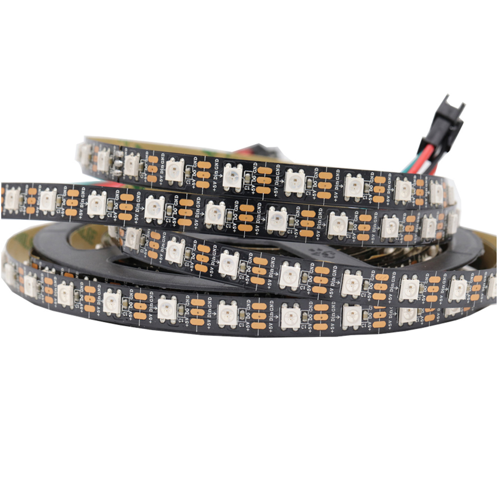

WS2812 (NeoPixels)
===================
WS2812s, also referred to as NeoPixels, are a popular type of individually
adressable RGB LEDs. They can be used on the robot for multiple uses: communicating
between human players and the driver, showing robot status, or just looking cool.

.. warning:: 
    WS2812s use a lot of power and RAM. Power can be calculated, but not RAM. 
    Make sure to be conservative with your use of WS2812s on the robot in order to 
    avoid excessive power draw and RAM usage.

Connections
--------------
The WS2812s that we have so far are from CTR ELectronics, and so this wiring guide applies to them. 

These LEDs in particular have 5 wires: 3 bunched together just plug into the RIO and 2 bunched together are for power.

- The power wires (2 bunched together) plug into the VRM port
  
.. note:: 
    In order to decide how much power you need, refer to the :ref:`Powering the LEDs` 
    section.

- The 3 wires bunched together plug into a RoboRIO PWM port
  
.. _Powering the LEDs:

Powering the LEDs
------------------
In order to calculate how much power you need, there is a formula that you can use:

.. code-block:: 

    Number of LEDS * 20 / 1000 = Power Draw (Amps)

Using the number of LEDs that you are powering in total, you can get the power
draw. Using this information, you can decide which VRM port to use (**5V 2A** or 
**5V 500mA**), and how many LEDs you can safely power with that port.

.. note::
    It is recommended that you add a little bit of buffer room on this, around
    0.2 Amps, so that the LEDs dont flicker, dim, or brownout.
    